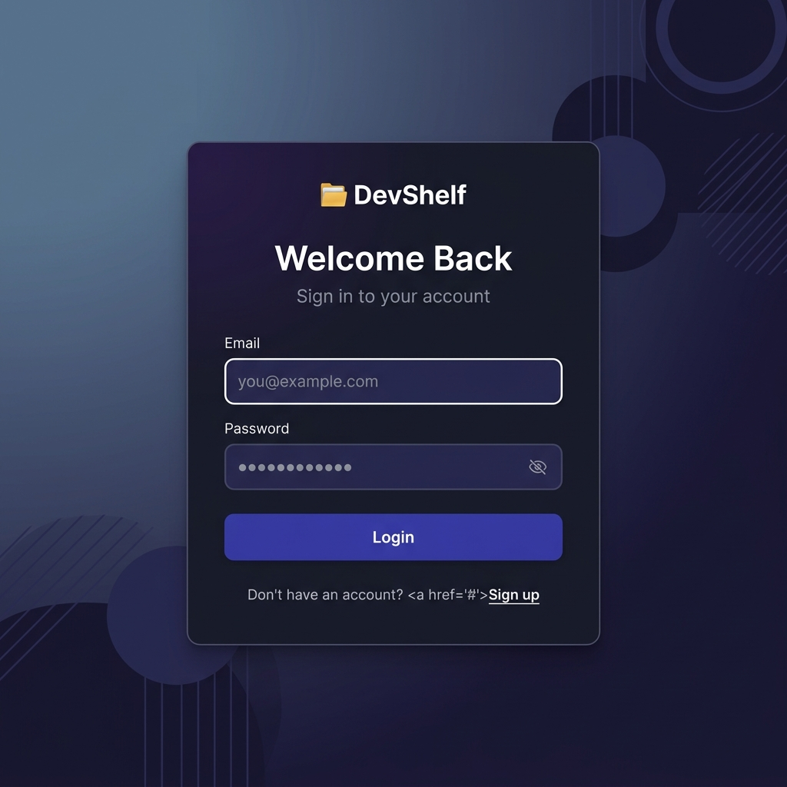
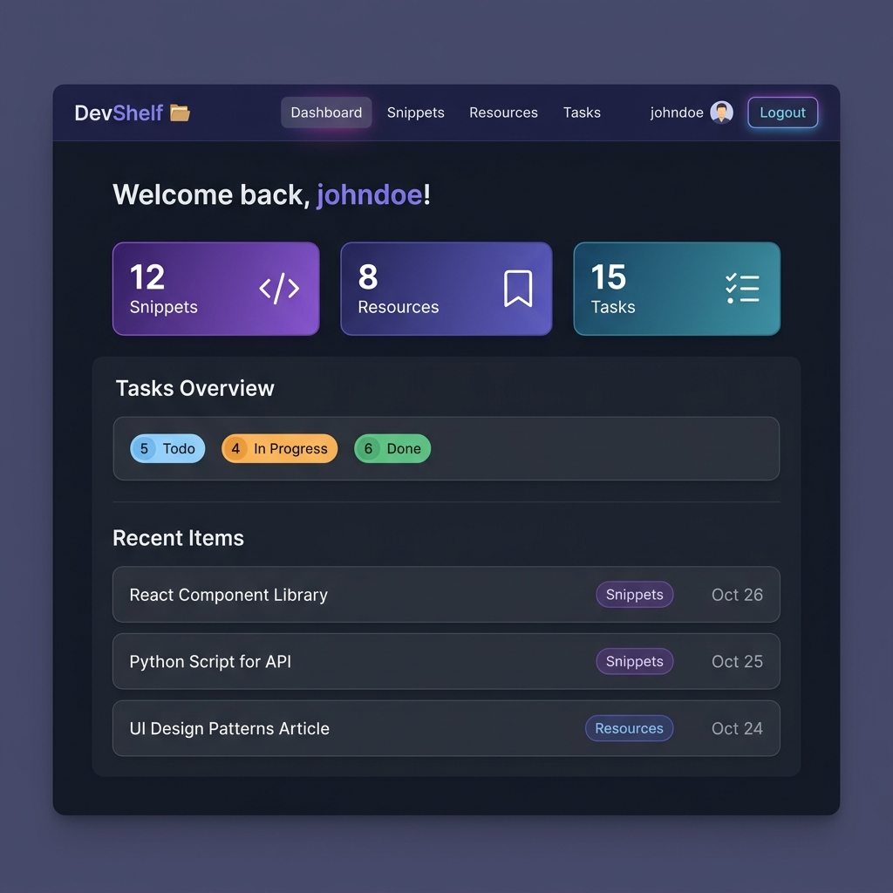
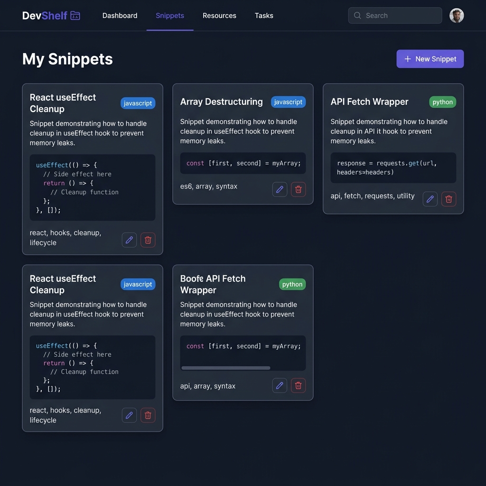
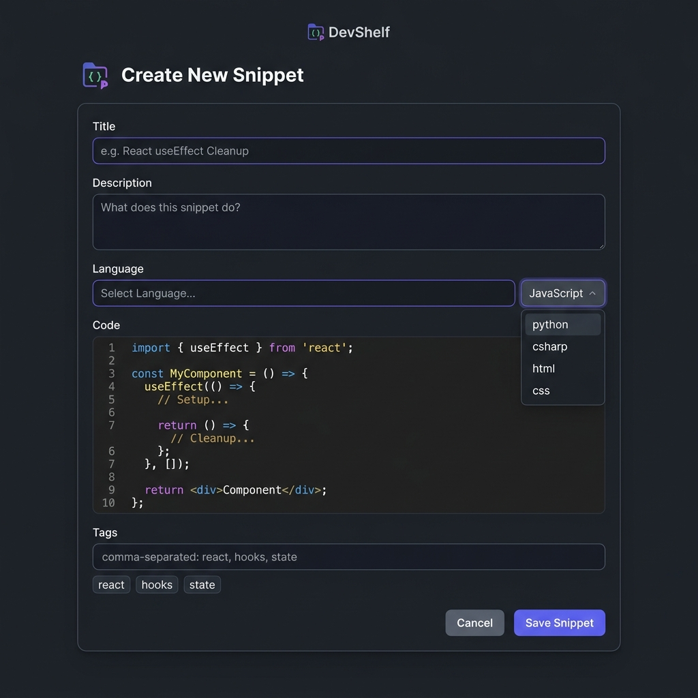
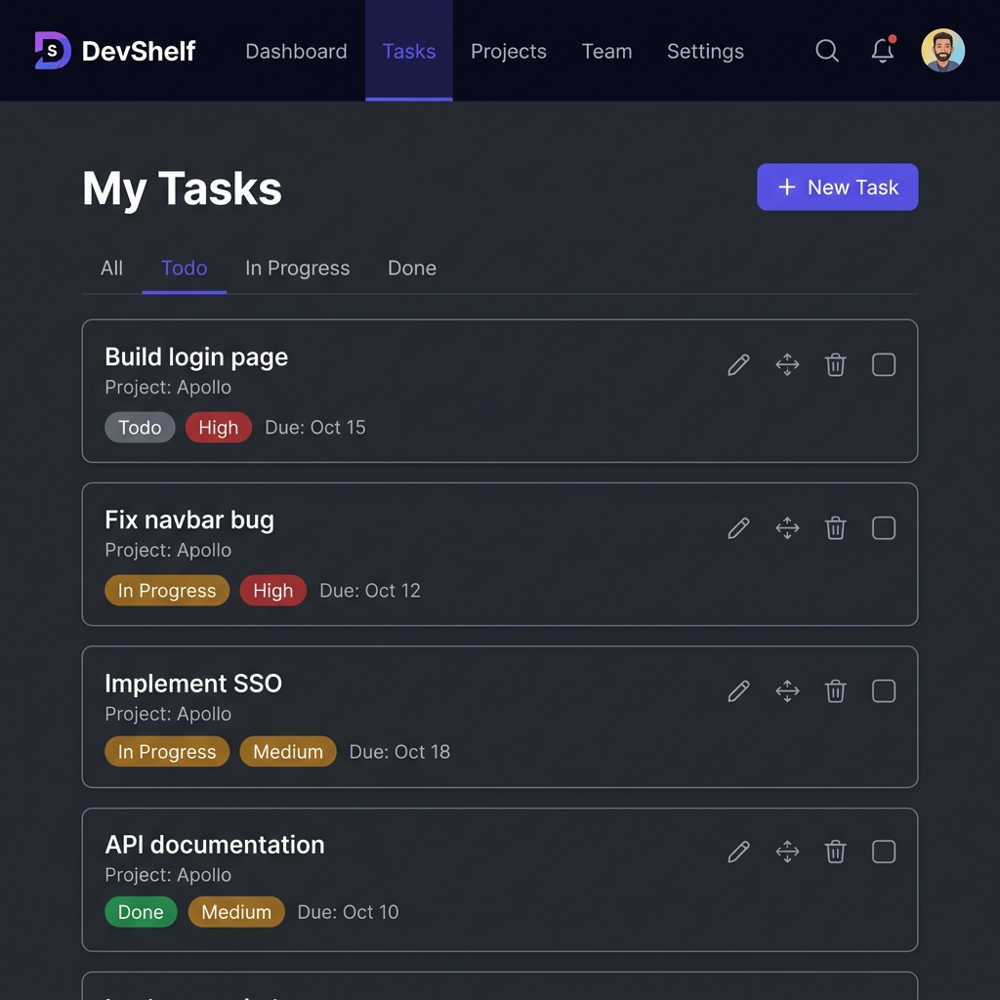

# 🗂️ DevShelf — React Frontend Assessment

## Your Developer Command Center

> **Build the complete React frontend for DevShelf** — a developer productivity app where you can save code snippets, bookmark resources, and track tasks. The backend API is already built and running. Your job is to create the entire frontend from scratch using React.

---

## 📋 Assessment Overview

| Detail | Info |
|--------|------|
| **Project** | DevShelf — Developer Productivity Dashboard |
| **What you build** | Complete React frontend (from an empty `src/` folder) |
| **What's provided** | Working .NET API server + empty Vite/React scaffold with dependencies |
| **Duration** | 5–7 days |
| **Type** | Individual assessment |
| **Submission** | Push your code to GitHub |

### What's Already Done For You

✅ A fully working .NET backend API with these features:
- User registration and login (returns JWT token)
- Snippets CRUD (Create, Read, Update, Delete)
- Resources CRUD
- Tasks CRUD (with quick status toggle)
- Dashboard stats endpoint
- SQLite database (no setup needed)

✅ A React project scaffold with dependencies pre-installed:
- React 19, React Router v7, Axios, React Hot Toast, Tailwind CSS v4
- Vite dev server configured
- Environment variable pointing to the API

### What You Need to Build

🔨 **Everything inside `client/src/`** — all pages, components, services, context, and routing.

### 🎨 UI Mockups — Your Visual Guide

> **📂 Mockup files are located in:** `docs/mockups/`
>
> Use these as your design reference throughout the assessment. Your app doesn't need to be pixel-perfect, but it should have the **same functionality and general layout** shown below.

| Mockup | File | Used In |
|--------|------|---------|
| Login Page | `docs/mockups/login-page.png` | Sprint 1 — Step 1.4 |
| Dashboard | `docs/mockups/dashboard-page.png` | Sprint 4 — Step 4.1 |
| Snippets Page | `docs/mockups/snippets-page.png` | Sprint 2 — Step 2.2 |
| Snippet Form | `docs/mockups/snippet-form.png` | Sprint 2 — Step 2.4 |
| Tasks Page | `docs/mockups/tasks-page.png` | Sprint 3 — Step 3.2 |

#### Login Page
> Build this in Sprint 1 (Step 1.4) — a centered card with email/password fields, submit button, and link to register.



#### Dashboard Page
> Build this in Sprint 4 (Step 4.1) — stat cards showing totals, task status breakdown, and recent items.



#### Snippets Page
> Build this in Sprint 2 (Step 2.2) — a grid of snippet cards with code previews, language badges, and edit/delete buttons.



#### Create/Edit Snippet Form
> Build this in Sprint 2 (Step 2.4) — a form with title, language dropdown, code textarea, description, and tags.



#### Tasks Page
> Build this in Sprint 3 (Step 3.2) — task list with status/priority badges, filter tabs, and quick status toggle.



---

## 🚀 Setup Instructions

### Step 1: Clone the repository

```bash
git clone <repository-url>
cd 3LOGY-BOOTCAMP-QUATERLY-FRAMEWORK-REACT-ASSESSMENT-DevHub
```

### Step 2: Start the backend server

```bash
cd server
dotnet run
```

The API will start on `https://localhost:7001`. Keep this terminal open.

> **⚠️ First time?** If you get a certificate warning, run `dotnet dev-certs https --trust` first.

### Step 3: Start the React dev server

Open a **new terminal**:

```bash
cd client
npm install    # Install dependencies (already in package.json)
npm run dev
```

The React app will start on `http://localhost:5173`.

### Step 4: Verify the API is working

Open your browser or Postman and test:
```
GET https://localhost:7001/api/auth/login
```

You should get a response (even if it's an error — that means the server is running).

### Step 5: Check the `.env.local` file

Make sure `client/.env.local` contains:
```
VITE_API_URL=https://localhost:7001
```

> **📖 API Reference:** See [API_REFERENCE.md](./API_REFERENCE.md) for every endpoint, request body, and response format.

---

## 🧠 Before You Start — How This All Works

> **This section is crucial.** Read it carefully before writing any code. It explains how your React frontend connects to the .NET backend — the pattern you'll use in real-world jobs.

### How Frontend + Backend Work Together

In a real-world app, the **frontend** (React) and **backend** (.NET API) are two separate programs running on different ports:

```
┌─────────────────────────┐         ┌─────────────────────────┐
│   REACT FRONTEND        │         │   .NET BACKEND API      │
│   http://localhost:5173  │ ──────▶ │   https://localhost:7001│
│                         │ HTTP    │                         │
│   - Shows the UI        │ requests│   - Stores data in DB   │
│   - Handles user input  │ ◀────── │   - Processes logic     │
│   - Sends API requests  │ JSON    │   - Returns JSON data   │
│   - Displays responses  │ responses│  - Handles auth        │
└─────────────────────────┘         └─────────────────────────┘
```

**Your React app never touches the database directly.** It sends HTTP requests (GET, POST, PUT, DELETE) to the API, and the API returns JSON data. Your React code then displays that data.

### The Authentication Flow (How Login Actually Works)

This is the part that confuses most beginners. Here's exactly what happens step by step:

```
1. User fills in email + password on your LoginPage
                    │
                    ▼
2. Your React code sends a POST request to /api/auth/login
   with { email, password } in the request body
                    │
                    ▼
3. The .NET server checks the database:
   - Does this email exist? Is the password correct?
   - If YES → creates a JWT token (a long encoded string)
   - Returns: { id, userName, email, token: "eyJhbG..." }
                    │
                    ▼
4. Your React code receives the response and saves the
   token to localStorage (browser storage that persists)
                    │
                    ▼
5. For ALL future API requests (snippets, resources, etc.),
   your code attaches the token in the headers:
   Authorization: Bearer eyJhbG...
                    │
                    ▼
6. The server reads the token, knows WHO is making the
   request, and returns only THAT user's data
```

**Why localStorage?** If you only stored the token in React state, it would disappear when the user refreshes the page. localStorage persists across refreshes and browser restarts.

### What Is an Axios Interceptor?

You'll hear this term a lot. Think of it as a **middleware for your HTTP requests** — a function that runs automatically before every request you make:

```
Without interceptor (❌ tedious):
  Every API call manually adds: headers: { Authorization: Bearer ${token} }

With interceptor (✅ smart):
  You set it up ONCE, and every API call automatically gets the token added
```

### How a React SPA (Single Page Application) Works

> **This is the biggest "aha" moment for beginners.** In a traditional website (HTML), every link click loads an entirely new page from the server. In React, there's only ONE HTML page — React just swaps out the content dynamically.

**Traditional website (multiple pages):**
```
Click "Dashboard" → Browser loads /dashboard.html (full page reload, flash of white)
Click "Snippets"  → Browser loads /snippets.html  (full page reload, flash of white)
Click "Tasks"     → Browser loads /tasks.html     (full page reload, flash of white)
```

**React SPA (single page, content swaps):**
```
Click "Dashboard" → React swaps the content area to show <DashboardPage /> (instant, no reload)
Click "Snippets"  → React swaps the content area to show <SnippetsPage />  (instant, no reload)
Click "Tasks"     → React swaps the content area to show <TasksPage />     (instant, no reload)
```

The URL in the address bar changes (`/dashboard` → `/snippets`), but the browser **never reloads**. React Router handles this.

### Shared Layout: How Navbar Stays While Pages Change

In DevShelf, the **Navbar is always visible** on every page. The Navbar never disappears or reloads — only the content below it changes. This is the "layout" pattern:

```
┌─────────────────────────────────────────────────┐
│                   NAVBAR                         │ ← Always visible
│  🗂️ DevShelf   Dashboard  Snippets  Resources   │    (shared component)
│                                     Tasks  Logout│
├─────────────────────────────────────────────────┤
│                                                  │
│              PAGE CONTENT                        │ ← Only this part
│                                                  │    changes when you
│         (DashboardPage, SnippetsPage,            │    click a link
│          ResourcesPage, TasksPage, etc.)         │
│                                                  │
│                                                  │
└─────────────────────────────────────────────────┘
```

**How this works in your App.jsx code:**
```jsx
<BrowserRouter>
  <AuthProvider>

    <Navbar />          {/* ← OUTSIDE Routes = shows on EVERY page */}

    <Routes>            {/* ← ONLY the matching route renders below */}
      <Route path="/login" element={<LoginPage />} />
      <Route path="/dashboard" element={<DashboardPage />} />
      <Route path="/snippets" element={<SnippetsPage />} />
      <Route path="/resources" element={<ResourcesPage />} />
      <Route path="/tasks" element={<TasksPage />} />
    </Routes>

  </AuthProvider>
</BrowserRouter>
```

**Key insight:**
- `<Navbar />` is **outside** the `<Routes>` block → it renders on EVERY page
- Each `<Route>` component **inside** `<Routes>` only renders when the URL matches its `path`
- When the URL is `/snippets`, React renders `<Navbar />` + `<SnippetsPage />`
- When the URL changes to `/tasks`, React keeps `<Navbar />` and swaps `<SnippetsPage />` for `<TasksPage />`

### Components vs Pages — What Goes Where?

```
┌─────────────────────────────────────────────────────────────┐
│ PAGES (src/pages/)                                          │
│ ─────────────────                                           │
│ Full-screen views that match a URL route.                   │
│ Each page is a "screen" the user sees.                      │
│                                                             │
│ Examples:                                                   │
│ • LoginPage.jsx      → shown at /login                     │
│ • DashboardPage.jsx  → shown at /dashboard                 │
│ • SnippetsPage.jsx   → shown at /snippets                  │
│                                                             │
│ Pages CONTAIN components. A page is built FROM components.  │
├─────────────────────────────────────────────────────────────┤
│ COMPONENTS (src/components/)                                │
│ ────────────────────────────                                │
│ Reusable building blocks used INSIDE pages.                 │
│ They are NOT tied to a specific URL.                        │
│                                                             │
│ Examples:                                                   │
│ • Navbar.jsx         → used on every page                  │
│ • ProtectedRoute.jsx → wraps protected pages               │
│ • SnippetCard.jsx    → used inside SnippetsPage             │
│ • SnippetForm.jsx    → used inside SnippetsPage             │
│ • TaskCard.jsx       → used inside TasksPage               │
│                                                             │
│ Components receive DATA via props from their parent page.   │
└─────────────────────────────────────────────────────────────┘
```

**Example: How SnippetsPage uses components:**
```
SnippetsPage.jsx (the PAGE - fetches data, manages state)
  ├── Renders "New Snippet" button
  ├── If showForm is true:
  │   └── <SnippetForm />         (COMPONENT - handles the form)
  └── For each snippet:
      └── <SnippetCard />         (COMPONENT - displays one snippet)
          ├── Shows title, code preview, tags
          ├── Edit button → tells the page to show form with data
          └── Delete button → tells the page to remove this snippet
```

**The rule:** Pages do the heavy lifting (fetching data, managing state). Components are the visual building blocks that display data and report user actions back to the page via callback props.

### Navigation in React — `<Link>` vs `<a>` vs `useNavigate`

In React, there are **three ways** to navigate, and using the wrong one is a very common beginner mistake:

**1. `<Link to="/snippets">` — for clickable links in JSX (replaces `<a>` tags)**
```jsx
// ✅ CORRECT — React Router handles it, no page reload
import { Link } from 'react-router-dom';
<Link to="/snippets">View Snippets</Link>

// ❌ WRONG — causes full page reload, destroys React state
<a href="/snippets">View Snippets</a>
```
> **Rule:** NEVER use `<a href>` for internal navigation. Always use `<Link to>`. The `<a>` tag is only for external links (like `<a href="https://react.dev">`).

**2. `useNavigate()` — for programmatic navigation (in code, after an action)**
```jsx
import { useNavigate } from 'react-router-dom';

const navigate = useNavigate();

const handleSubmit = async (e) => {
  e.preventDefault();
  await login(email, password);
  navigate('/dashboard');  // ← Redirect AFTER login succeeds
};
```
Use `useNavigate` when you need to redirect the user **after something happens** (form submission, logout, etc.) — you can't click a `<Link>` in code.

**3. `<Navigate to="/login" />` — for automatic redirects in JSX**
```jsx
import { Navigate } from 'react-router-dom';

// In ProtectedRoute: if not logged in, redirect immediately
if (!isAuthenticated) return <Navigate to="/login" />;
```

### Axios Response Shape — `response.data`

This trips up almost every beginner. When you make an API call with axios, the response object has this structure:

```javascript
const response = await api.post('/api/auth/login', { email, password });

// response = {
//   data: { id, userName, email, token },  ← The actual JSON from the server
//   status: 200,                            ← HTTP status code
//   headers: { ... },                       ← Response headers
//   config: { ... },                        ← Request config
// }

// ✅ You want this:
const userData = response.data;           // { id, userName, email, token }
const token = response.data.token;        // "eyJhbG..."

// ❌ NOT this (this is the full wrapper):
const wrong = response;                   // { data, status, headers, config }
```

**Rule of thumb:** Always use `response.data` to get the actual JSON the API sent back.

### URL Parameters — `useParams` for Detail Pages

When you navigate to `/snippets/abc-123`, the `abc-123` part is a **URL parameter**. React Router lets you read it using `useParams()`:

```jsx
// In your route (App.jsx):
<Route path="/snippets/:id" element={<SnippetDetailPage />} />
//                     ^^^ This ":id" creates a parameter

// In SnippetDetailPage.jsx:
import { useParams } from 'react-router-dom';

const { id } = useParams();  // id = "abc-123"
// Now use this id to fetch the specific snippet from the API
```

The `:id` in the route path is a placeholder. Whatever appears in the URL at that position becomes the value of `id`.

### Tailwind CSS Quick Reference

You're using Tailwind for styling. Here are the most common classes you'll need:

**Layout:**
```
flex               → display: flex
flex-col           → flex-direction: column
items-center       → align-items: center
justify-between    → justify-content: space-between
gap-4              → gap between children (4 = 1rem)
grid               → display: grid
grid-cols-2        → 2 columns
grid-cols-3        → 3 columns
```

**Spacing:**
```
p-4     → padding all sides (4 = 1rem)
px-4    → padding left + right
py-2    → padding top + bottom
m-4     → margin all sides
mb-4    → margin bottom only
mt-2    → margin top only
```

**Typography:**
```
text-sm     → small text
text-lg     → large text
text-xl     → extra large
text-2xl    → even bigger
font-bold   → bold
text-gray-500   → gray text
text-indigo-600 → indigo text
```

**Colors & Backgrounds:**
```
bg-white         → white background
bg-gray-50       → light gray
bg-indigo-600    → indigo (brand color)
text-white       → white text
border           → add border
border-gray-200  → light gray border
rounded          → rounded corners
rounded-lg       → more rounded
shadow           → subtle shadow
shadow-lg        → larger shadow
```

**Buttons (combine classes):**
```jsx
<button className="bg-indigo-600 text-white px-4 py-2 rounded-lg hover:bg-indigo-700">
  Save Snippet
</button>
```

**Cards (combine classes):**
```jsx
<div className="bg-white rounded-lg shadow p-6 border border-gray-200">
  {/* Card content */}
</div>
```

**Forms:**
```jsx
<input className="w-full border border-gray-300 rounded-lg px-3 py-2 focus:outline-none focus:ring-2 focus:ring-indigo-500" />
```

> **Tip:** You don't need to memorize these. Refer to [tailwindcss.com/docs](https://tailwindcss.com/docs) and search for any CSS property.

### Git Workflow — Commit After Every Sprint

**Save your progress.** If you break something, you can always go back.

```bash
# After finishing Sprint 1:
git add .
git commit -m "feat: complete Sprint 1 - auth, routing, protected routes"

# After finishing Sprint 2:
git add .
git commit -m "feat: complete Sprint 2 - snippets CRUD"

# After finishing Sprint 3:
git add .
git commit -m "feat: complete Sprint 3 - resources and tasks"

# After finishing Sprint 4:
git add .
git commit -m "feat: complete Sprint 4 - dashboard and polish"
git push origin main
```

> **⚠️ Commit even if things aren't perfect.** A working Sprint 1 + broken Sprint 2 is worth 40 points. An uncommitted, broken mess is worth 0.

### How to Create Folders and Files

Inside the `client/src/` folder, you need to create subfolders. Here's how:

**In VS Code:**
1. Right-click on the `src/` folder in the Explorer sidebar
2. Click "New Folder"
3. Type the folder name (e.g., `services`)
4. Right-click on the new folder → "New File"
5. Type the file name (e.g., `api.js`)

**Or from the terminal:**
```bash
cd client/src
mkdir services context components pages
```

**Create these folders now** before you start coding:
```bash
client/src/
├── services/      # Create this folder
├── context/       # Create this folder
├── components/    # Create this folder
└── pages/         # Create this folder
```

### How to Test Your Work (IMPORTANT!)

After each step, you should verify your code works. Here's how:

**1. Check the browser console (F12 → Console tab)**
- Red errors? Something is broken. Read the error message — it tells you what's wrong.
- No errors? Good, move to the next step.

**2. Check the Network tab (F12 → Network tab)**
- When your app makes an API call, you'll see it here
- Click on the request to see what was sent and what came back
- Status `200` or `201` = success, `401` = token problem, `400` = bad request data

**3. Check localStorage (F12 → Application tab → Local Storage)**
- After login, you should see a `token` key with a long string value
- If it's not there, your login function isn't saving the token correctly

**4. Use `console.log()` liberally**
```javascript
// Temporarily add these to debug:
console.log("Login response:", response);
console.log("Token saved:", localStorage.getItem('token'));
console.log("User state:", user);
```
Remove console.logs before submitting, but use them freely while developing.

### Troubleshooting Common Issues

| Problem | Likely Cause | Fix |
|---------|-------------|-----|
| `Network Error` or `ERR_CONNECTION_REFUSED` | Backend server isn't running | Open a terminal, `cd server`, run `dotnet run` |
| `CORS error` in console | Frontend URL mismatch | Make sure your React app runs on `http://localhost:5173` (the port the server allows) |
| `401 Unauthorized` on API calls | Token not being sent | Check your axios interceptor — is it reading from localStorage correctly? |
| `400 Bad Request` on login/register | Wrong request body shape | Check the [API_REFERENCE.md](./API_REFERENCE.md) — your JSON field names must match exactly (case-sensitive!) |
| Page is blank after refresh | Session not restored | Your AuthContext `useEffect` should check for existing token on mount |
| `Cannot read properties of undefined` | Trying to use data before it loads | Add a loading check: `if (isLoading) return <p>Loading...</p>` |
| `Module not found` error | Wrong import path | Check your file path — is it `./services/api` or `../services/api`? The `./` means same folder, `../` means go up one folder |

---

## 📐 Project Structure (What You Will Create)

By the end of this assessment, your `client/src/` folder should look like this:

```
client/src/
├── main.jsx                        # ✅ Provided — don't modify
├── index.css                       # ✅ Provided — you can extend
├── App.jsx                         # 🔨 You create this
│
├── services/                       # 🔨 API communication layer
│   ├── api.js                      #    Axios instance + interceptor
│   ├── authService.js              #    Login, register, logout, getProfile
│   ├── snippetService.js           #    Snippets CRUD
│   ├── resourceService.js          #    Resources CRUD
│   └── taskService.js              #    Tasks CRUD + status update
│
├── context/                        # 🔨 Global state
│   └── AuthContext.jsx             #    Auth state provider
│
├── components/                     # 🔨 Reusable UI pieces
│   ├── Navbar.jsx                  #    Navigation bar
│   ├── ProtectedRoute.jsx          #    Auth guard for routes
│   └── (any other components)      #    Cards, forms, modals, etc.
│
└── pages/                          # 🔨 Full page views
    ├── LoginPage.jsx
    ├── RegisterPage.jsx
    ├── DashboardPage.jsx
    ├── SnippetsPage.jsx
    ├── SnippetDetailPage.jsx
    ├── ResourcesPage.jsx
    └── TasksPage.jsx
```

### 📍 Import Path Cheatsheet

> This will save you from `Module not found` errors. When importing files, the path depends on WHERE the importing file is located.

| If you're writing code in... | And you want to import from... | The import path is |
|------------------------------|-------------------------------|-------------------|
| `src/services/authService.js` | `src/services/api.js` | `./api` (same folder) |
| `src/context/AuthContext.jsx` | `src/services/authService.js` | `../services/authService` (up one, into services) |
| `src/pages/LoginPage.jsx` | `src/context/AuthContext.jsx` | `../context/AuthContext` (up one, into context) |
| `src/pages/SnippetsPage.jsx` | `src/services/snippetService.js` | `../services/snippetService` (up one, into services) |
| `src/pages/SnippetsPage.jsx` | `src/components/SnippetCard.jsx` | `../components/SnippetCard` (up one, into components) |
| `src/App.jsx` | `src/pages/LoginPage.jsx` | `./pages/LoginPage` (into pages) |
| `src/App.jsx` | `src/context/AuthContext.jsx` | `./context/AuthContext` (into context) |

**Rule of thumb:** `./` = same folder, `../` = go up one folder, `../../` = go up two folders.

---

## 🏃 Sprint 1 — Authentication & Routing (40 points)

> **Goal:** Users can register, log in, and access protected pages. This sprint is the foundation everything else builds on.

**🎯 Target for this sprint:**


### Step 1.1: Create the Axios API Instance

📁 **Create file:** `src/services/api.js`

**Why this file?** In real-world projects, you never scatter `axios.get("https://some-url/...")` all over your code. Instead, you create ONE configured axios instance that knows your API's base URL and automatically handles authentication. Every other file imports this instance.

**What to do:**
1. Import `axios` from the `axios` package
2. Create an axios instance using `axios.create()` with the `baseURL` set to the environment variable `import.meta.env.VITE_API_URL`
3. Add a **request interceptor** — before every request, check if there's a token in `localStorage` (key: `"token"`). If there is, add it to the request headers as `Authorization: Bearer <token>`
4. Export the axios instance as the default export

**React concepts:** ES6 modules, environment variables, axios interceptors

**Hint — what the structure looks like:**
```javascript
import axios from 'axios';

const api = axios.create({
  baseURL: /* your environment variable here */
});

// Add a request interceptor
api.interceptors.request.use((config) => {
  // 1. Get the token from localStorage
  // 2. If it exists, add it to config.headers.Authorization
  // 3. Return config (you must always return config!)
});

export default api;
```

**✅ How to verify:** You can't fully test this file alone — it's a utility. But make sure there are no red errors in the browser console. You'll know it works when Step 1.2 successfully makes API calls.

---

### Step 1.2: Create the Auth Service

📁 **Create file:** `src/services/authService.js`

**Why this file?** This is your "API communication layer" for authentication. It keeps all auth-related API calls in one place. Your React components never call `axios.post()` directly — they call `authService.login()` instead. This is a real-world pattern called **separation of concerns**.

**What to do:**
1. Import your axios instance from `./api.js` (use `import api from './api'`)
2. Create these functions:

| Function | What it does |
|----------|-------------|
| `login(email, password)` | POST to `/api/auth/login`, save the `token` from the response to `localStorage`, return the full response data |
| `register(userName, email, password)` | POST to `/api/auth/register`, return the response data |
| `logout()` | Remove `token` from `localStorage` |
| `getToken()` | Return the token from `localStorage` (or null) |
| `getProfile()` | GET from `/api/profile`, return the response data |

3. Export all functions as a default object: `export default { login, register, logout, getToken, getProfile }`
4. Each function that calls the API should use `try/catch` and throw meaningful errors

**Hint — what a service function looks like:**
```javascript
const login = async (email, password) => {
  try {
    const response = await api.post('/api/auth/login', { email, password });
    // Save the token to localStorage
    // Return the response data
  } catch (error) {
    // Throw a user-friendly error message
    throw error.response?.data || { error: 'Login failed' };
  }
};
```

**⚠️ Important:** The field names in your request body (`email`, `password`, `userName`) must match EXACTLY what the API expects. Check [API_REFERENCE.md](./API_REFERENCE.md) for the exact field names.

**React concepts:** Async/await, error handling, localStorage, API integration

**✅ How to verify:** You can temporarily test this in the browser console:
1. Open your app in the browser
2. Open DevTools (F12) → Console
3. Import and test (this won't work directly, but you'll validate it works when you build the login page next)

---

### Step 1.3: Create the Auth Context

📁 **Create file:** `src/context/AuthContext.jsx`

**Why this file?** In React, when multiple components need the same data (like "who is logged in?"), you use **Context**. Without Context, you'd have to pass `user`, `isAuthenticated`, `login`, `logout` as props through every single component — this is called "prop drilling" and it's painful. Context lets any component access this data directly.

**Think of it like this:**
```
Without Context (❌ prop drilling):
  App → passes user to → Navbar → passes user to → UserMenu
  App → passes user to → Dashboard → passes user to → WelcomeMessage

With Context (✅ clean):
  AuthProvider wraps everything
  Any component can grab 'user' directly using useContext()
```

**How Context "Broadcasting" Works — 3 Steps:**

Context works like a radio broadcast. There are exactly 3 steps:

```
STEP 1: CREATE the context (the radio station)
─────────────────────────────────────────────
  export const AuthContext = createContext();

STEP 2: PROVIDE the data (start broadcasting)
─────────────────────────────────────────────
  In App.jsx, you wrap your entire app:

  <AuthContext.Provider value={{ user, login, logout, isAuthenticated }}>
    <Navbar />           ← can receive the broadcast
    <Routes>
      <DashboardPage />  ← can receive the broadcast
      <SnippetsPage />   ← can receive the broadcast
    </Routes>
  </AuthContext.Provider>

  Everything inside the Provider tags can "tune in" to the data.

STEP 3: CONSUME the data (tune in to the broadcast)
─────────────────────────────────────────────
  In ANY component inside the Provider:

  const { user, logout } = useContext(AuthContext);

  Now you have access to 'user' and 'logout' without
  any props being passed! It came directly from the Provider.
```

**Visual: How data flows with Context:**
```
   AuthProvider (holds: user, login, logout, isAuthenticated)
        │
        │ broadcasts to ALL children automatically
        │
   ┌────┼──────────────┬─────────────────┐
   │    │              │                 │
   ▼    ▼              ▼                 ▼
 Navbar  LoginPage   DashboardPage   SnippetsPage
   │       │             │               │
   │       │             │               │
 uses:   uses:         uses:           uses:
 user    login         user            (nothing
 logout  isLoading     isAuthenticated  from auth)
```

**Key insight:** You call `useContext(AuthContext)` in a component, and React automatically finds the nearest `AuthContext.Provider` up the component tree and gives you whatever `value` it's broadcasting. If the `value` changes (e.g., user logs in), **every component using that context automatically re-renders** with the new data.

**What to do:**
1. Import `createContext`, `useState`, `useEffect` from React
2. Import your `authService` from `../services/authService`
3. Create and export an `AuthContext` using `createContext()`
4. Create and export an `AuthProvider` component that:

**State to manage (using `useState`):**
- `user` — object with user data (or empty object `{}`)
- `isLoading` — boolean, starts as `true`
- `error` — string or null

**Derived value:**
- `isAuthenticated` — derived from `user`: `!!user.id` (true if user has an ID)

**On mount (using `useEffect` with `[]` dependencies):**
- Check if a token exists in localStorage (use `authService.getToken()`)
- If yes, call `authService.getProfile()` to restore the user session
- If the profile fetch succeeds, set the `user` state
- If it fails (token expired), call `authService.logout()` and clear user state
- Set `isLoading` to `false` when done (in a `finally` block)

**Functions to create:**
- `login(email, password)` — calls `authService.login()`, updates `user` state with the response
- `register(userName, email, password)` — calls `authService.register()`, returns the response (user still needs to login after)
- `logout()` — calls `authService.logout()`, sets `user` back to `{}`

**Context value (what you provide to children):**
```javascript
{ user, isLoading, error, isAuthenticated, login, register, logout }
```

5. Wrap `{children}` in `<AuthContext.Provider value={value}>`

**Hint — what the skeleton looks like:**
```jsx
import { createContext, useState, useEffect } from "react";
import authService from "../services/authService";

export const AuthContext = createContext();

export const AuthProvider = ({ children }) => {
  // 1. Set up your state variables with useState
  const [user, setUser] = useState({});
  const [isLoading, setIsLoading] = useState(true);
  const [error, setError] = useState(null);

  // 2. Derive isAuthenticated from user
  const isAuthenticated = /* ... */;

  // 3. useEffect to restore session on page load
  useEffect(() => {
    const restoreSession = async () => {
      try {
        // Check for existing token
        // If exists, fetch profile
        // Update user state
      } catch (err) {
        // Token expired or invalid
        // Clear everything
      } finally {
        setIsLoading(false);
      }
    };
    restoreSession();
  }, []); // Empty array = runs once on mount

  // 4. Create login, register, logout functions
  const login = async (email, password) => {
    // Call authService.login()
    // Update user state with the response
  };

  // 5. Create the value object
  const value = { user, isLoading, error, isAuthenticated, login, register, logout };

  // 6. Return the Provider
  return (
    <AuthContext.Provider value={value}>
      {children}
    </AuthContext.Provider>
  );
};
```

**⚠️ Common mistake:** The `useEffect` runs an async function, but `useEffect` itself cannot be async. That's why we create an `async` function inside it and then call it.

**React concepts:** createContext, Provider pattern, useState, useEffect, async operations in useEffect

**✅ How to verify:** You won't see visible results yet (no UI), but your browser should have no errors. The real test comes when you build the Login page in the next step.

---

### Step 1.4: Create the Login Page

📁 **Create file:** `src/pages/LoginPage.jsx`

**Why this is exciting:** This is where you'll see your app come to life for the first time! You'll create a real login form that talks to the backend API.

**⚠️ Import paths from pages folder:**
Since this file is in `src/pages/`, you need `../` to go up one folder:
```javascript
import { AuthContext } from '../context/AuthContext';  // go up to src, then into context
```

**What to do:**
1. Import `useState`, `useContext` from React
2. Import `useNavigate`, `Link` from `react-router-dom`
3. Import your `AuthContext` from `../context/AuthContext`
4. Get `login`, `isLoading`, `error` from the AuthContext using `useContext(AuthContext)`
5. Create form state with `useState`:
   ```javascript
   const [formData, setFormData] = useState({ email: "", password: "" });
   ```
6. Create a `handleChange` function that updates form state when inputs change
7. Create a `handleSubmit` function that:
   - Prevents default form submission (`e.preventDefault()`)
   - Calls `login(formData.email, formData.password)`
   - On success, navigates to `/dashboard` using `useNavigate`
   - On error, displays the error message (use `react-hot-toast` or display inline)

8. Render a form with:
   - Email input (type="email", controlled by state)
   - Password input (type="password", controlled by state)
   - Submit button (shows "Logging in..." when `isLoading` is true)
   - Link to register page ("Don't have an account? Sign up") — use `<Link to="/register">`
   - Error display if `error` exists

**What "controlled input" means:**
A controlled input is an input whose value is driven by React state. It has TWO things:
```jsx
<input
  type="email"
  value={formData.email}         // 1. Value comes FROM state
  onChange={handleChange}         // 2. Changes go TO state
  name="email"                   // 3. Name helps handleChange know which field to update
/>
```

**What handleChange looks like:**
```javascript
const handleChange = (e) => {
  setFormData({
    ...formData,                        // Keep all existing fields
    [e.target.name]: e.target.value     // Update only the field that changed
  });
};
```
The `[e.target.name]` syntax is called a "computed property name" — it uses the input's `name` attribute to know which field to update. So if the `name="email"` input changes, it updates `formData.email`.

**React concepts:** useState, useContext, controlled inputs, form handling, event handling, conditional rendering

**Validation rules:**
- Both fields are required
- Email must be a valid email format
- Show validation errors before submitting

**✅ How to verify (YOUR FIRST REAL TEST!):**
> **Note:** You can't test this page until Step 1.8 (routing) is done. Skip ahead to wire up routes in App.jsx first, then come back and test.

Once routing is set up:
1. Navigate to `http://localhost:5173/login`
2. Try submitting with empty fields → you should see validation errors
3. Enter a valid email and password → check the Network tab (F12) to see the POST request
4. If you haven't registered yet, you'll get an error (that's expected!)
5. Go to Register first, create an account, then come back and login

---

### Step 1.5: Create the Register Page

📁 **Create file:** `src/pages/RegisterPage.jsx`

**What to do:**
Build a registration form similar to the login page, but with these fields:
- Username (text input)
- Email (email input)
- Password (password input)

**On successful registration:**
- Navigate to `/login` page
- Show a success toast: "Registration successful! Please log in."

**Validation rules:**
- All fields required
- Username must be at least 3 characters
- Email must be a valid format
- Password must be at least 6 characters

**React concepts:** useState, controlled inputs, form validation, conditional rendering, navigation

---

### Step 1.6: Create the Protected Route Component

📁 **Create file:** `src/components/ProtectedRoute.jsx`

**What to do:**
1. Import `useContext` from React
2. Import `Navigate` from `react-router-dom`
3. Import your `AuthContext`
4. Create a `ProtectedRoute` component that accepts `{ children }` as a prop
5. Get `isLoading` and `isAuthenticated` from AuthContext
6. If `isLoading`, return a loading indicator (e.g., "Loading...")
7. If not authenticated, return `<Navigate to="/login" />` (redirects to login)
8. If authenticated, return `{children}` (renders the protected page)

**React concepts:** useContext, conditional rendering, children prop, component composition

---

### Step 1.7: Create the Navbar

📁 **Create file:** `src/components/Navbar.jsx`

**What to do:**
1. Import `useContext` from React
2. Import `Link`, `useNavigate` from `react-router-dom`
3. Import your `AuthContext`
4. Get `user`, `isAuthenticated`, `logout` from AuthContext
5. Render a navigation bar that shows:

**When NOT logged in:**
- DevShelf logo/title (links to `/`)
- Login link
- Register link

**When logged in:**
- DevShelf logo/title (links to `/dashboard`)
- Dashboard link
- Snippets link
- Resources link
- Tasks link
- Username display
- Logout button (calls `logout()` and navigates to `/`)

**React concepts:** useContext, conditional rendering, React Router `<Link>`, event handling

---

### Step 1.8: Wire Up Routes in App.jsx

📁 **Create file:** `src/App.jsx`

**What to do:**
1. Import `BrowserRouter`, `Routes`, `Route` from `react-router-dom`
2. Import `Toaster` from `react-hot-toast`
3. Import your `AuthProvider` from context
4. Import your `Navbar` and `ProtectedRoute` components
5. Import all your pages
6. Create the route structure:

```
/              → HomePage (public — optional, can redirect to /login)
/login         → LoginPage (public)
/register      → RegisterPage (public)
/dashboard     → DashboardPage (protected)
/snippets      → SnippetsPage (protected)
/snippets/:id  → SnippetDetailPage (protected)
/resources     → ResourcesPage (protected)
/tasks         → TasksPage (protected)
```

**Structure:**
```jsx
<BrowserRouter>
  <AuthProvider>
    <Navbar />
    <Toaster position="top-right" />
    <Routes>
      {/* Public routes */}
      {/* Protected routes — wrap with <ProtectedRoute> */}
    </Routes>
  </AuthProvider>
</BrowserRouter>
```

**React concepts:** React Router (BrowserRouter, Routes, Route), component composition, provider pattern

### ✅ Sprint 1 Checkpoint

At this point you should be able to:
- [ ] Register a new account
- [ ] Log in with that account
- [ ] See the Navbar change when logged in vs logged out
- [ ] Get redirected to `/login` when trying to access `/dashboard` without being logged in
- [ ] Stay logged in after refreshing the page (token restored from localStorage)
- [ ] Log out and get redirected

**If this works, you have earned up to 40 points. Move to Sprint 2!**

---

## 🏃 Sprint 2 — Snippets CRUD (25 points)

> **Goal:** Users can create, view, edit, and delete code snippets. This sprint tests your ability to fetch data, render lists, handle forms, and manage state.

**🎯 Target for this sprint:**


### Step 2.1: Create the Snippet Service

📁 **Create file:** `src/services/snippetService.js`

**What to do:**
1. Import your axios instance from `./api.js`
2. Create and export these functions:

| Function | HTTP | Endpoint | Returns |
|----------|------|----------|---------|
| `getAll()` | GET | `/api/snippets` | Array of snippets |
| `getById(id)` | GET | `/api/snippets/{id}` | Single snippet |
| `create(data)` | POST | `/api/snippets` | Created snippet |
| `update(id, data)` | PUT | `/api/snippets/{id}` | Updated snippet |
| `remove(id)` | DELETE | `/api/snippets/{id}` | Success message |

Each function should use `try/catch` and throw meaningful errors.

**React concepts:** API service pattern, async/await, error handling

---

### Step 2.2: Create the Snippets Page

📁 **Create file:** `src/pages/SnippetsPage.jsx`

**What to do:**
1. Create state variables:
   - `snippets` — array, starts as `[]`
   - `isLoading` — boolean, starts as `true`
   - `error` — string or null
   - `showForm` — boolean for showing/hiding the create form
   - `editingSnippet` — object or null (the snippet being edited)

2. **Fetch snippets on mount** using `useEffect`:
   - Call `snippetService.getAll()`
   - Update `snippets` state with the response
   - Handle loading and error states
   - Use the `[]` dependency array so it runs only once

3. **Render the page:**
   - "New Snippet" button → toggles `showForm`
   - If `showForm` is true, render a snippet form (inline or modal)
   - If loading, show a loading spinner
   - If error, show an error message
   - If no snippets, show an empty state ("No snippets yet. Create your first one!")
   - If snippets exist, render them as a list/grid using `.map()`:
     ```jsx
     {snippets.map(snippet => (
       <SnippetCard
         key={snippet.id}
         snippet={snippet}
         onEdit={() => handleEdit(snippet)}
         onDelete={() => handleDelete(snippet.id)}
       />
     ))}
     ```

4. **Implement handlers:**
   - `handleCreate(data)` — call `snippetService.create(data)`, add new snippet to state array (immutable update)
   - `handleEdit(snippet)` — set `editingSnippet` state, show form
   - `handleUpdate(id, data)` — call `snippetService.update(id, data)`, update the snippet in state array (immutable update with `.map()`)
   - `handleDelete(id)` — call `snippetService.remove(id)`, remove from state (immutable update with `.filter()`)

**React concepts:** useEffect, useState, .map() with key prop, immutable state updates, conditional rendering, component composition

**Hints for immutable updates:**
```javascript
// Add to array
setSnippets([newSnippet, ...snippets]);

// Update in array
setSnippets(snippets.map(s => s.id === id ? updatedSnippet : s));

// Remove from array
setSnippets(snippets.filter(s => s.id !== id));
```

---

### Step 2.3: Create the Snippet Card Component

📁 **Create file:** `src/components/SnippetCard.jsx` (or in a `snippets/` subfolder)

**What to do:**
1. Accept props: `snippet`, `onEdit`, `onDelete`
2. Display:
   - Title
   - Language (as a badge/tag)
   - Description (truncated if long)
   - Code preview (first 3 lines)
   - Tags (if any)
   - Created date (formatted nicely)
3. Add Edit button → calls `onEdit()`
4. Add Delete button → calls `onDelete()`
5. Click on the card title → navigates to `/snippets/{id}` for full detail view

**React concepts:** Props (data + callback functions), event handling, JSX, conditional rendering

---

### Step 2.4: Create the Snippet Form Component

📁 **Create file:** `src/components/SnippetForm.jsx` (or in a `snippets/` subfolder)

**What to do:**
1. Accept props: `initialData` (object or null), `onSubmit` (function), `onCancel` (function), `isLoading` (boolean)
2. Use `useState` for form fields: `title`, `description`, `code`, `language`, `tags`
3. If `initialData` is provided, pre-fill the form (editing mode)
4. Implement `handleChange` for each input
5. Implement form validation:
   - Title is required
   - Code is required
   - Language is required
   - Show validation errors next to each field
6. On submit, call `onSubmit(formData)`

**Language options for dropdown:**
`javascript`, `python`, `csharp`, `html`, `css`, `sql`, `typescript`, `java`, `other`

**React concepts:** useState, controlled inputs, form validation, props, conditional rendering (edit vs create mode)

---

### Step 2.5: Create the Snippet Detail Page

📁 **Create file:** `src/pages/SnippetDetailPage.jsx`

**What to do:**
1. Import `useParams` from `react-router-dom` to get the snippet ID from the URL
2. Use `useState` for: `snippet`, `isLoading`, `error`
3. Use `useEffect` with `[id]` as the dependency to fetch the snippet:
   ```javascript
   useEffect(() => {
     const fetchSnippet = async () => {
       try {
         setIsLoading(true);
         const data = await snippetService.getById(id);
         setSnippet(data);
       } catch (err) {
         setError('Failed to load snippet');
       } finally {
         setIsLoading(false);
       }
     };
     fetchSnippet();
   }, [id]);
   ```
4. Display the full snippet: title, description, full code block, language, tags, dates
5. Add a "Copy Code" button that copies the code to clipboard
6. Add a "Back to Snippets" link

**React concepts:** useParams (React Router), useEffect with dependencies, async data fetching

---

### ✅ Sprint 2 Checkpoint

At this point you should be able to:
- [ ] See a list of snippets (empty state if none)
- [ ] Create a new snippet via the form
- [ ] See the new snippet appear in the list without refreshing
- [ ] Edit an existing snippet
- [ ] Delete a snippet and see it removed from the list
- [ ] Click a snippet to see its full detail page
- [ ] Navigate back from the detail page

**If this works, you have earned up to 65 points total. Move to Sprint 3!**

---

## 🏃 Sprint 3 — Resources & Tasks (20 points)

> **Goal:** Apply the same patterns you built in Sprint 2 to two more features. This sprint should go faster because you're repeating patterns you already know.

**🎯 Target for this sprint (Tasks page):**


### Step 3.1: Resources (10 points)

Create these files following the same patterns as Snippets:

📁 `src/services/resourceService.js`
- `getAll()`, `getById(id)`, `create(data)`, `update(id, data)`, `remove(id)`

📁 `src/pages/ResourcesPage.jsx`
- Fetch and display resources
- Create, edit, delete resources
- Show loading/error/empty states

📁 `src/components/ResourceCard.jsx`
- Display: title, URL (clickable link), type badge, notes preview, tags
- Edit and Delete buttons

📁 `src/components/ResourceForm.jsx`
- Fields: title, url, notes, type (dropdown), tags
- Type options: `article`, `video`, `tool`, `docs`, `other`
- Validation: title and url are required

---

### Step 3.2: Tasks (10 points)

Create these files:

📁 `src/services/taskService.js`
- Same CRUD functions as snippets
- **Plus:** `updateStatus(id, status)` — PATCH to `/api/tasks/{id}/status`

📁 `src/pages/TasksPage.jsx`
- Fetch and display tasks
- Create, edit, delete tasks
- **Add status filter:** buttons or tabs to filter by "All", "Todo", "In Progress", "Done"
- Each task card should have a quick status toggle (dropdown or buttons)

📁 `src/components/TaskCard.jsx`
- Display: title, description, status badge, priority badge, project, due date
- Status toggle (call `taskService.updateStatus()`)
- Edit and Delete buttons

📁 `src/components/TaskForm.jsx`
- Fields: title, description, status, priority, project, dueDate
- Status dropdown: `todo`, `in-progress`, `done`
- Priority dropdown: `low`, `medium`, `high`
- Validation: title is required

### ✅ Sprint 3 Checkpoint

At this point you should be able to:
- [ ] Full CRUD on Resources (create, view, edit, delete)
- [ ] Full CRUD on Tasks
- [ ] Filter tasks by status
- [ ] Quick-toggle task status without opening the full form

**If this works, you have earned up to 85 points total. Move to Sprint 4!**

---

## 🏃 Sprint 4 — Dashboard & Polish (15 points)

> **Goal:** Create a dashboard overview and polish the overall experience.

**🎯 Target for this sprint:**


### Step 4.1: Dashboard Page (5 points)

📁 **Create file:** `src/pages/DashboardPage.jsx`

**What to do:**
1. Use `useEffect` to fetch stats from `/api/dashboard/stats` on mount
2. Display:
   - Total counts: X snippets, Y resources, Z tasks
   - Tasks by status: Todo / In Progress / Done (consider a visual bar or chart)
   - Recent items: last 5 snippets, resources, and tasks (render as small cards or a list)
3. Handle loading and error states

**React concepts:** useEffect, API fetch, conditional rendering, component composition

---

### Step 4.2: Layout & Navigation Polish (5 points)

**What to do:**
1. Make sure your Navbar highlights the current active page
2. Ensure all pages have consistent styling and spacing
3. Add loading spinners (not just "Loading..." text)
4. Add proper empty states with helpful messages
5. Add toast notifications for all actions (create, update, delete)

---

### Step 4.3: Bonus Features (5 points)

Choose any of these for extra credit:

**🌙 Dark/Light Mode Toggle (2 points)**
- Add a toggle button in the Navbar
- Save the preference to `localStorage`
- Use `useEffect` to restore the preference on page load
- Apply dark/light styles using CSS classes or variables

**⚡ React.memo() Optimization (1 point)**
- Wrap your card components (`SnippetCard`, `ResourceCard`, `TaskCard`) with `React.memo()`
- Explain in a code comment WHY this helps (when does it prevent re-renders?)

**🚀 Deploy to Netlify or Vercel (2 points)**
1. Run `npm run build` to create a production build
2. Deploy to Netlify or Vercel
3. Add a `_redirects` file in `public/` for SPA routing:
   ```
   /*    /index.html   200
   ```
4. Set environment variables on the hosting platform
5. Submit your deployed URL

---

## 📦 Submission Instructions

1. **Push your code to GitHub:**
   ```bash
   git add .
   git commit -m "feat: complete DevShelf React frontend"
   git push origin main
   ```

2. **Your GitHub repo should contain:**
   - All your frontend code in `client/src/`
   - The server code (unchanged) in `server/`
   - No `node_modules/` folders committed

3. **Optional:** Include your deployed URL in the repo README

---

## 📚 Helpful Resources

- [React Documentation](https://react.dev) — Official docs
- [React Router v7](https://reactrouter.com) — Routing docs
- [Axios](https://axios-http.com) — HTTP client docs
- [Tailwind CSS](https://tailwindcss.com) — Styling framework
- [React Hot Toast](https://react-hot-toast.com) — Toast notifications

---

## 💡 Tips for Success

1. **Build Sprint 1 first.** Don't skip to snippets before auth works. Everything depends on the token.
2. **Test each step.** After creating `authService.js`, test it in the browser console before building the UI.
3. **Use the API Reference.** Every endpoint is documented with example requests and responses. When in doubt, check [API_REFERENCE.md](./API_REFERENCE.md).
4. **Commit often.** Make a commit after each major step. This protects your work.
5. **Don't style first.** Get the functionality working, then make it pretty. A working app with basic styling scores higher than a beautiful app that doesn't work.
6. **Check the console.** Open your browser DevTools (F12) → Console tab. Fix any errors or warnings.
7. **Read error messages.** API errors tell you exactly what's wrong. A `401` means your token is missing or expired. A `400` means your request body is wrong.

---

## ⚠️ Common Mistakes to Avoid

| Mistake | Why It's Wrong | What to Do Instead |
|---------|---------------|---------------------|
| Storing token in state only | Token disappears on page refresh | Store in `localStorage`, restore in `useEffect` |
| Forgetting `key` prop in `.map()` | React can't track list items efficiently | Always use a unique `key` (use `id`, never array index) |
| Mutating state directly | React won't re-render | Use spread operator or `.map()`/`.filter()` for immutable updates |
| Missing `useEffect` dependencies | Stale data or infinite loops | Include all values your effect uses in the dependency array |
| Not handling loading states | User sees blank page | Always show a spinner or skeleton while fetching data |
| Hardcoding API URLs | Breaks on deployment | Use `import.meta.env.VITE_API_URL` |

---

## 🔍 How to Research & Use AI Tools (The Right Way)

> **Real talk:** You WILL get stuck. You WILL need to look things up. That's not cheating — that's what professional developers do every single day. The difference is HOW you use these tools.

### ✅ The Right Way to Research

**1. Start with the official docs (best source)**

| What You're Stuck On | Where to Look |
|----------------------|---------------|
| React hooks (useState, useEffect) | [react.dev/reference](https://react.dev/reference/react) |
| React Router (Link, useNavigate, useParams) | [reactrouter.com](https://reactrouter.com) |
| Axios (making API calls) | [axios-http.com/docs](https://axios-http.com/docs/intro) |
| Tailwind classes | [tailwindcss.com/docs](https://tailwindcss.com/docs) |
| JavaScript (map, filter, spread, async/await) | [developer.mozilla.org](https://developer.mozilla.org) |

**2. Google specific error messages**

When you get an error, copy-paste the exact error message into Google:
```
❌ Bad search: "react not working"
✅ Good search: "TypeError: Cannot read properties of undefined (reading 'map')"
✅ Good search: "react useEffect missing dependency warning"
✅ Good search: "axios 401 unauthorized react"
```

**3. Search for concepts, not solutions**

```
❌ Bad: "react login page code"              → You'll get someone's full code that doesn't fit your project
✅ Good: "how to handle form submission react" → You'll learn the pattern and apply it yourself
✅ Good: "useEffect cleanup function explained" → You'll understand WHY, not just WHAT
✅ Good: "axios interceptor request example"   → You'll learn the concept and adapt it
```

### 🤖 Using AI Tools (ChatGPT, Copilot, etc.)

AI tools are allowed, but **how you use them determines whether you learn or not.**

**✅ USE AI TO:**

| Do This | Example Prompt |
|---------|---------------|
| **Understand a concept** | *"Explain how useContext works in React. Give me a simple analogy."* |
| **Debug an error** | *"I'm getting this error: [paste error]. Here's my code: [paste code]. What's wrong?"* |
| **Understand code you wrote** | *"Can you explain what this useEffect does line by line?"* |
| **Learn a pattern** | *"How does the axios interceptor pattern work? Explain step by step."* |
| **Review your approach** | *"I'm building a login page in React. Here's my plan: [describe]. Does this approach make sense?"* |

**❌ DO NOT USE AI TO:**

| Don't Do This | Why It Hurts You |
|---------------|-----------------|
| *"Write me a complete login page in React"* | You copy-paste code you don't understand. You'll fail the next project. |
| *"Build me an AuthContext with login and logout"* | You skip the hardest part of learning. The struggle IS the lesson. |
| *"Give me all the code for a CRUD snippets page"* | Your code won't match the project's API or structure. You'll spend more time fixing it than writing it yourself. |

### 🧠 The "Can I Explain This?" Test

After using ANY external resource (Google, AI, Stack Overflow, YouTube), ask yourself:

> **"If my tutor asked me to explain this code line by line, could I?"**

- **YES** → You learned from it. Good. ✅
- **NO** → You copy-pasted without understanding. Go back and figure out what each line does. ❌

### 💡 Pro Tip: Use AI as a Study Buddy, Not a Coder

The best way to use AI on this assessment:

1. **Try it yourself first** — Write the code, even if it's broken
2. **When stuck, ask AI to explain the concept** — not to write the code
3. **If your code doesn't work, ask AI to help debug** — paste your code and the error
4. **After getting it working, ask AI to review** — "Is there a better way to do this?"

This is exactly how senior developers use AI in their jobs. They don't ask AI to write their features — they use it to learn faster and debug smarter.

---

**Good luck! Build something you're proud of. 🚀**
